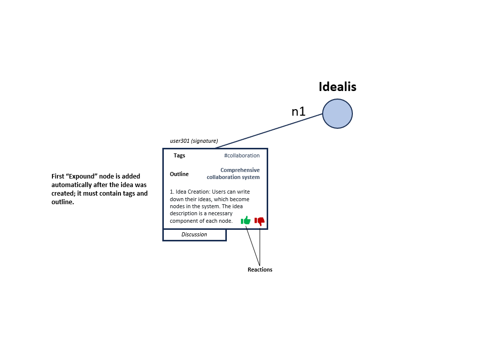
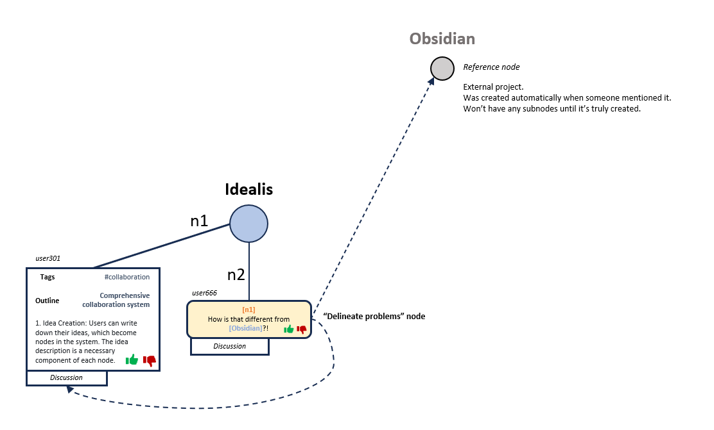
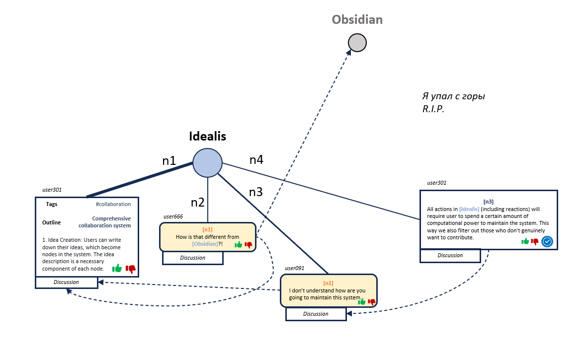
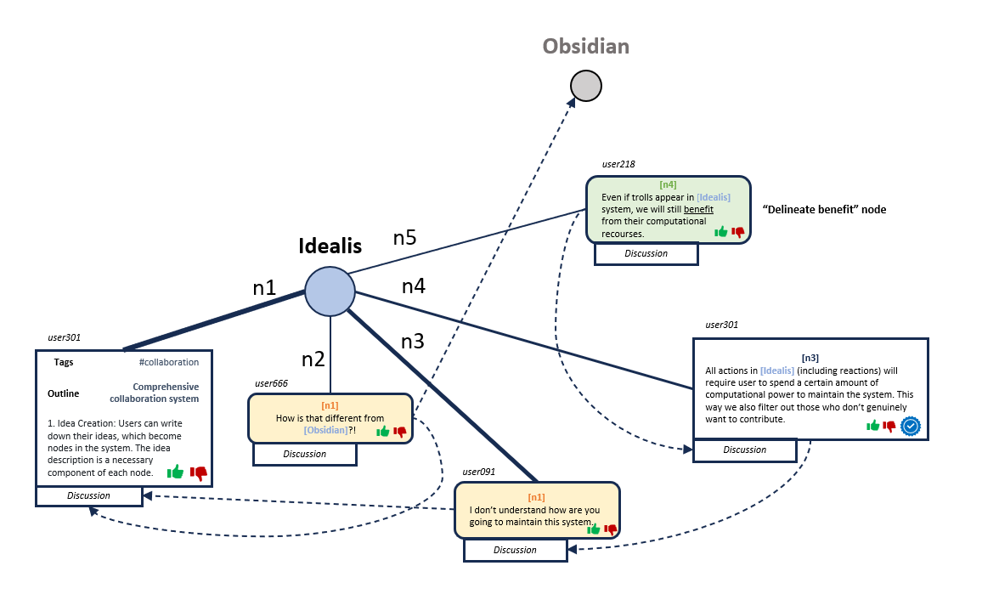
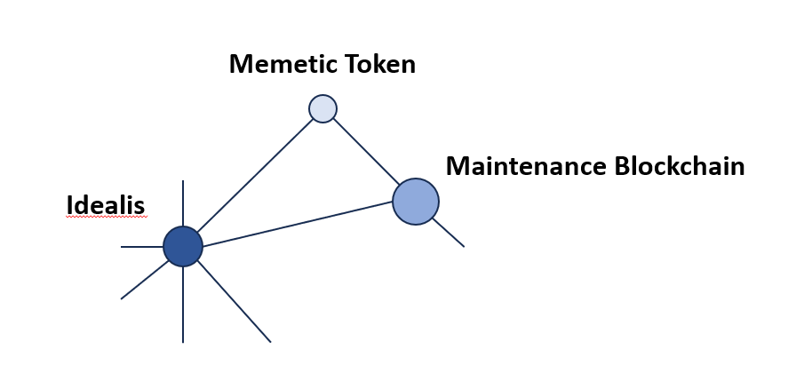

# Workflow

## Idealis local network

### Idea reveals itself for the first time through user's perspective

1. Idea must have at least a couple of tags, so that future users can easily find it;
2. Idea must have an outline, which is like an abstract a research paper.
3. The first "Expound" node (E-node) usually has a more elaborate description, but that's completely optional. Users can add more information in future "Expound" nodes.

### Idea is being challenged

1. Any idea can be challenged by creating "Delineate problems" node (DP-node);
2. This node must refer to at least one E-node in its header;
3. The main difference between this node and an E-node is that it attracts the users with its distinguished color scheme. Also, it might enter the "resolved" state which makes it bleak and uninteresting, yet it won't disappear entirely; 
4. The resolved state is entered in two cases:
   1.  When the blue "Resolved" button located on the E-nodes reffering to this DP-node is pressed a certain amount of times. The threshold is calculated based on the number of users actively participating in discussion by creating nodes;
   
   2.  When the red "Disagree" button located on DP-node is pressed twice as much as the green "Agree" button. The evaluation happens when 1 day passes after the DP-node was created, then after 2 days, then after 3 days, then after 5 days, then after 8 days and so on.
5. The resolved state can be reversed during the evaluation if the "Agree" button was pressed twice as much as the "Disagree" button. The thresholds for the "Resolved" reactions will also be recalculated in this case.

Notice how edges weights are growing as new nodes appear. The more particular node is mentioned, the more infuence it gets. In addition, reactions like "Agree" or "Disagree" also affect node's infulence.

### Why should I care? Delineating benefits.

1. "Delineating benefits" nodes (DB-nodes) are used to specify the importance of the particular idea. Contrary to neutral and scientific E-nodes, they may be written in a less formal, more emotional style. 

## Idealis global network

1. Influence - based on the pagerank algorithm, affects node size (larger nodes have higher influence);
2. Relevance - based on the number of nodes, reactions, users and so on. "Trendy" nodes have more vibrant color.

